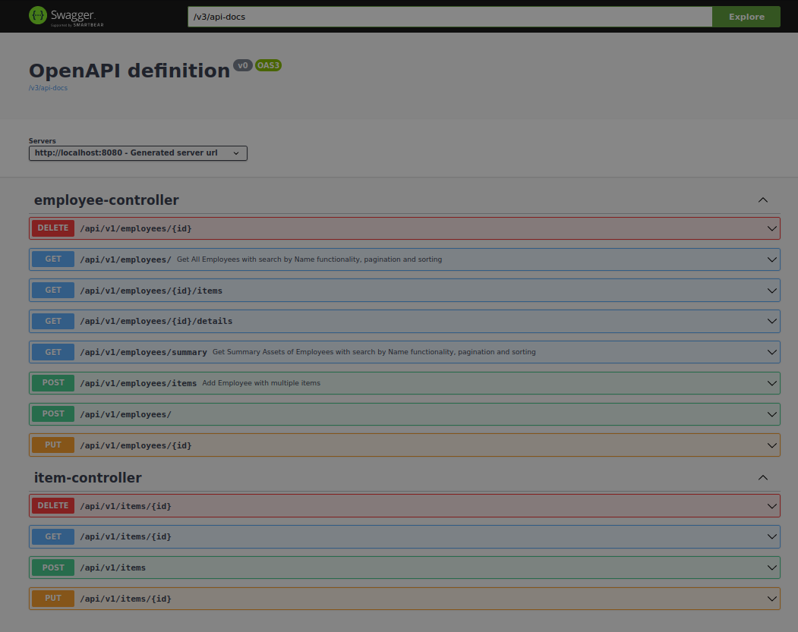

# AssetTracker Spring Boot Application

AssetTracker is a RESTful API application for tracking material assets issued to employees for use.
It is built using Spring Boot, Hibernate, Flyway, Swagger, Lombok and uses a PostgreSQL database.

### Running app
Follow this steps:

* Install Postgres, Java and Maven on your machine:
```sudo apt install java```
```sudo apt install postgres```
```sudo apt install maven```
* Create a PostgreSQL database with name ```CREATE DATABASE sampledb```.
* Clone the repository: ```git clone 'url-to-git-project'```
* Navigate to directory: ```cd restapi```
* Edit the application.properties file located in src/main/resources to set the correct values for the ```spring.datasource.username``` and ```spring.datasource.password``` properties.
* Run the application:  ```mvn spring-boot:run```


### API Documentation

* Navigate in web browser http://localhost:8080/swagger-ui/index.html
  


##### Get All Employees with search by Name functionality, pagination and sorting

```
GET /api/v1/employees/?name=john&page=0&size=10&sortBy=name&direction=asc
```

#### Get Summary Assets of Employees
```
GET /summary?name=John&page=0&size=5&sortBy=name&direction=asc
```

#### Get Employee details with Items by ID
```
GET /api/employees/1/details

```

#### Other endpoints at http://localhost:8080/swagger-ui/index.html

